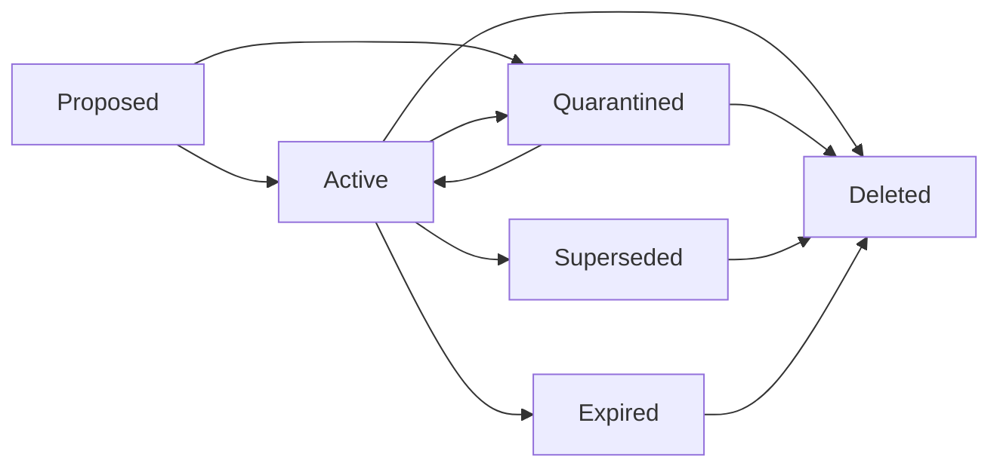

# Agent Memory Record

| Field | Value |
| --- | --- |
| Author | Jason Doyle |
| Version | 1.0.0 |
| Created | 31 August 2026 |
| Last reviewed | 31 August 2026 |

Persistent agent memory is production state when it can influence later
reasoning or actions. This field guide provides a concrete record contract and
review method for that state.

The artifacts are vendor-neutral. They can be used with relational databases,
document stores, vector indexes, agent framework memory services, or custom
storage layers.

## Included artifacts

| Artifact | Use |
| --- | --- |
| [memory-record.schema.json](memory-record.schema.json) | Validate the shape and required safety properties of a memory record |
| [examples](examples/README.md) | Inspect representative records across several lifecycle states |
| [audit-checklist.md](audit-checklist.md) | Review a memory design before launch and during material changes |
| [control-mapping.md](control-mapping.md) | Connect review questions to schema fields, runtime controls, and evidence |

## What the schema records

The contract separates the content being remembered from the evidence and
policy that determine whether it deserves trust.

| Area | Main fields | Reliability purpose |
| --- | --- | --- |
| Identity | `id`, `version`, `schemaVersion` | Support history, compatibility, and optimistic concurrency |
| Classification | `memoryClass`, `riskTier`, `status` | Apply controls according to purpose and consequence |
| Content | `content.statement`, `content.structuredValue` | Preserve a human-readable assertion and optional machine value |
| Scope | `scope.namespace`, `owner`, `subjects`, `audience` | Prevent cross-user, cross-tenant, and cross-environment reuse |
| Provenance | `source`, `writer`, `observedAt`, `capturedAt` | Distinguish evidence from inference and support investigation |
| Validation | `status`, `validatedBy`, `confidence` | Record how the memory was checked without claiming certainty |
| Lifecycle | validity, review, expiry, retention, deletion | Stop stale or deleted state from remaining silently active |
| Policy | sensitivity and allowed or prohibited uses | Bound how a valid memory may influence later work |
| Relationships | derivation, conflict, and supersession links | Preserve history and avoid equally active contradictions |
| Governance | approval, tests, and rollback | Treat active procedures as versioned operational policy |
| Audit | creation, retrieval, and influence references | Reconstruct which version could have affected an outcome |

## Risk tiers

Risk follows consequence, not the storage technology.

| Tier | Typical memory | Minimum expectation |
| --- | --- | --- |
| 0 | Current task context | Session boundary, size limit, and no cross-user reuse |
| 1 | Output preference | User visibility, correction, identity scope, and reasonable expiry |
| 2 | Service owner or project decision | Provenance, freshness, conflict handling, and source revalidation |
| 3 | Deployment or incident procedure | Named owner, versioning, tests, approval, and rollback |
| 4 | Entitlement, access, or regulated fact | Authoritative lookup and deterministic policy before action |

The schema enforces several tier-sensitive constraints:

- every active record must have a verified status;
- tier 2 and above must define a review or expiry time;
- tier 4 must require authoritative source validation before action;
- an active procedure must be approved, tested, and reversible;
- a superseded record must identify its successor;
- a deleted tombstone cannot retain the original content.

These are baseline controls, not a complete risk assessment.

## Lifecycle



Applications should treat status as an eligibility control. Only active records
should enter ordinary retrieval. Proposed and quarantined records require a
separate review path. Superseded, expired, and deleted records must not return
through normal retrieval.

## Adoption sequence

### 1. Build records from authenticated context

The application should supply `scope.namespace`, actor identity, and access
policy. Do not allow the model to invent or expand its own storage scope.

### 2. Validate before persistence

Validate the complete record against the JSON Schema. Then apply controls that
cannot be expressed by JSON Schema, including:

- whether the writer may write this scope and memory class;
- whether the source may establish this kind of fact;
- whether timestamps follow a valid temporal order;
- whether the evidence hash and source revision match;
- whether the retention policy exists;
- whether untrusted content requires quarantine.

### 3. Use version-aware writes

Increment `version` for each mutation. Use compare-and-swap, an entity tag, or a
transaction so two writers cannot silently overwrite each other. Preserve
supersession relationships when a fact changes.

### 4. Filter before semantic ranking

A safe retrieval order is:

1. authenticated namespace and access policy;
2. active status;
3. temporal validity and retention policy;
4. sensitivity and permitted use;
5. unresolved conflicts;
6. source authority and validation status;
7. semantic or keyword relevance.

Similarity should not override scope, status, or policy.

### 5. Revalidate before consequential action

Memory may locate evidence or prepare a decision. For tier 4, and for dynamic
tier 2 or 3 facts with material consequences, retrieve current truth from the
authoritative system and apply deterministic policy before execution.

### 6. Record influence separately

The record contains summary audit fields, but it is not an append-only event
log. Record reads, writes, consolidation, corrections, and material uses in a
protected audit stream. An influence event should identify the memory `id` and
`version` supplied to the agent.

### 7. Verify expiry and deletion

Configured expiry is not proof that a record became unavailable. Monitor expiry
latency and test each declared deletion scope. Retain only the minimum tombstone
needed to prevent accidental resurrection and prove the covered operation.

## Validate the examples

From the repository root:

```powershell
npm ci
npm test
```

The test suite validates every JSON document in `agent-memory/examples` and
checks negative cases for the contract's main safety constraints.

## What this contract does not provide

The schema does not:

- decide whether a statement is true;
- implement authentication or authorisation;
- inspect prompts for injection;
- resolve semantic contradictions;
- prove that deletion reached every derivative, log, or backup;
- make a memory safe for a use not allowed by policy;
- replace the system of record for consequential state.

Those controls require application behaviour and operational evidence. Use the
[audit checklist](audit-checklist.md) and
[control mapping](control-mapping.md) to review them.

## Versioning

`schemaVersion` describes the contract used to validate a record. `version`
describes the revision of one memory identity.

Consumers should:

- reject unsupported major schema versions;
- validate records at write and read boundaries;
- migrate records explicitly rather than interpreting missing fields silently;
- retain the original schema version in audit events.

## Related paper

This field guide is a practical companion to
[When Memory Becomes Production State](https://jasondoyle.ie/whitepapers/when-memory-becomes-production-state/).
